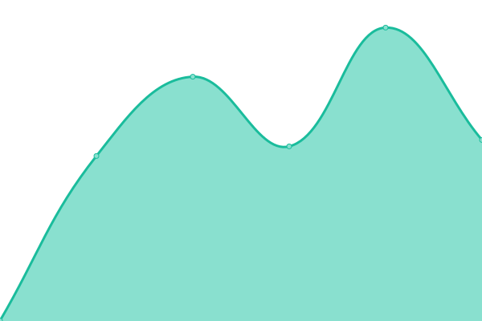
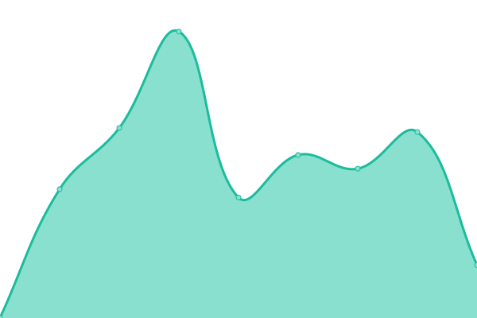

# [📈 Live Status](https://pilasguru.github.io/upptime): <!--live status--> **🟩 All systems operational**

This repository contains the open-source uptime monitor and status page for [Rodolfo Pilas](http://pilas.guru), powered by [Upptime](https://github.com/upptime/upptime).

With [Upptime](https://upptime.js.org), you can get your own unlimited and free uptime monitor and status page, powered entirely by a GitHub repository. We use [Issues](https://github.com/pilasguru/upptime/issues) as incident reports, [Actions](https://github.com/pilasguru/upptime/actions) as uptime monitors, and [Pages](https://pilasguru.github.io/upptime) for the status page.

<!--start: status pages-->
<!-- This summary is generated by Upptime (https://github.com/upptime/upptime) -->
<!-- Do not edit this manually, your changes will be overwritten -->
<!-- prettier-ignore -->
| URL | Status | History | Response Time | Uptime |
| --- | ------ | ------- | ------------- | ------ |
|  [Blog](https://pilas.guru) | 🟩 Up | [blog.yml](https://github.com/pilasguru/upptime/commits/HEAD/history/blog.yml) | 

 637ms
     
 | 

<a href="https://pilasguru.github.io/upptime/history/blog">100.00%</a>
    

|  [Deployandome](https://deployando.me) | 🟩 Up | [deployandome.yml](https://github.com/pilasguru/upptime/commits/HEAD/history/deployandome.yml) | 

 1119ms
     
 | 

<a href="https://pilasguru.github.io/upptime/history/deployandome">100.00%</a>
    

|  [Pi.lastr.us](https://pi.lastr.us) | 🟩 Up | [pi-lastr-us.yml](https://github.com/pilasguru/upptime/commits/HEAD/history/pi-lastr-us.yml) | 

 471ms
     
 | 

<a href="https://pilasguru.github.io/upptime/history/pi-lastr-us">100.00%</a>
    

|  [Pil.as](http://pil.as) | 🟩 Up | [pil-as.yml](https://github.com/pilasguru/upptime/commits/HEAD/history/pil-as.yml) | 

 364ms
     
 | 

<a href="https://pilasguru.github.io/upptime/history/pil-as">100.00%</a>
    

|  [Agujero Del Mate](http://www.agujerodelmate.org) | 🟩 Up | [agujero-del-mate.yml](https://github.com/pilasguru/upptime/commits/HEAD/history/agujero-del-mate.yml) | 

 445ms
     
 | 

<a href="https://pilasguru.github.io/upptime/history/agujero-del-mate">100.00%</a>
    

<!--end: status pages-->

[**Visit our status website →**](https://pilasguru.github.io/upptime)

## 📄 License

- Code: [MIT](./LICENSE) © [Rodolfo Pilas](http://pilas.guru)
- Data in the `./history` directory: [Open Database License](https://opendatacommons.org/licenses/odbl/1-0/)
